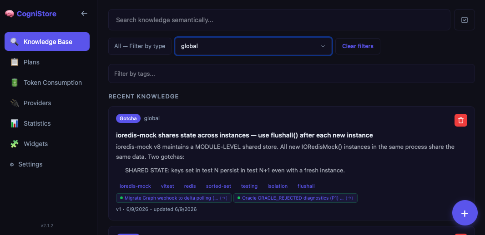

<div align="center">


**Knowledge & Plan Management for AI Agents**

Store, search, and retrieve knowledge using local vector embeddings — directly from your AI assistant.

[](https://github.com/Sithion/cognistore/actions/workflows/ci.yml)
[](https://www.npmjs.com/package/@cognistore/mcp-server)
[](https://github.com/Sithion/cognistore/releases)
[](LICENSE)

[Download](#quick-start) · [Features](#features) · [MCP Integration](#mcp-integration) · [External Providers](#external-knowledge-providers) · [Dashboard](#dashboard) · [Development](#development) · [Patch Notes](PATCH-NOTES.md)



</div>

---

## Overview

CogniStore is a desktop application that gives your AI coding agents a persistent, searchable memory. It runs entirely on your machine — no cloud, no API keys, no data leaving your laptop.

The app acts as an [MCP](https://modelcontextprotocol.io/) server for **Claude Code**, **GitHub Copilot**, and **OpenCode**, allowing your AI assistant to store and retrieve knowledge with semantic search powered by local embeddings.

## Features

- **Local-first** — All data stays on your machine. SQLite database with vector search via `sqlite-vec`.
- **Semantic search** — Find knowledge by meaning, not just keywords. Powered by Ollama embeddings running natively.
- **External knowledge providers (MCP)** — Optionally augment local search by connecting [MCP servers](documentation/providers/plug-mcp.md) — local **stdio** subprocesses or **remote** Streamable HTTP servers (authenticated with **OAuth 2.1** or a static header). Results are returned **sectioned by source** and labeled untrusted; secrets live in the OS keychain. Opt-in and disabled by default — see the [providers docs](documentation/providers/providers-config.md).
- **MCP integration** — Works as a plugin for Claude Code, GitHub Copilot, and OpenCode out of the box. OpenCode also gets a plan enforcement plugin for lifecycle tracking.
- **Zero configuration** — The setup wizard handles everything: Ollama, database, model downloads, MCP config injection, AI skills installation, and system knowledge seeding.
- **System knowledge** — Mandatory protocol entries (type `system`) are seeded on setup, injected into agent sessions via hooks, hidden from the dashboard, and protected from deletion. Agents always operate with the correct protocol without manual configuration.
- **Knowledge cleanup cycle** — Every 10 days (at least — the cycle only advances while the app is running) the app proposes what could be removed: entries tagged `deprecated`, entries nobody has retrieved in six months, and near-duplicate groups to merge into their newest member. Merges are drafted by a small local model via Ollama, with a deterministic fallback. **Nothing is deleted automatically** — you approve each item in Settings.
- **Plans** — Create and manage implementation plans with task lists, priority tracking, relations to knowledge entries, and archive completed plans from the dashboard. Plans also form **chains**: the first plan of an effort is the ORIGINAL, and every follow-up (including ones created by subagents) links back to it, so the whole lineage stays visible.
- **Provenance tracking** — Every entry and plan records which **platform** (Claude Code / Copilot / OpenCode, auto-detected) and which **agent** (the calling agent's own name) created it, surfaced as dashboard charts and knowledge-list filters.
- **Desktop dashboard** — Browse, search, filter, and manage your knowledge base and plans through the built-in UI with stats and charts. All destructive actions use modal confirmations.
- **Auto-update** — The app checks for updates every 30 minutes and installs them automatically.
- **Multi-language** — Dashboard available in English, Spanish, and Portuguese.
- **Cross-platform** — macOS (Apple Silicon, `.dmg`) and Linux (`.AppImage`, `.deb`).

## Quick Start

### 1. Download

Grab the latest release for your platform from [GitHub Releases](https://github.com/Sithion/cognistore/releases).

| Platform | Format |
|----------|--------|
| macOS (Apple Silicon) | `.dmg` (arm64, M1/M2/M3/M4) |
| Linux | `.AppImage`, `.deb` |

### 2. Install

Open the downloaded file and drag the app to your Applications folder (macOS) or run the AppImage (Linux).

> **macOS users:** The app is not code-signed, so on the **first launch** macOS Gatekeeper may report it is "damaged." This is expected. Either:
> - **Right-click** (or Control-click) the app in Applications → **Open** → confirm, or open **System Settings → Privacy & Security** and click **Open Anyway**; or
> - remove the download quarantine flag from a terminal:
>   ```bash
>   xattr -dr com.apple.quarantine "/Applications/CogniStore.app"
>   ```
>
> This is a **one-time** step for the initial install — in-app auto-updates thereafter need no workaround.

### 3. Run the Setup Wizard

On first launch, the setup wizard will automatically:

1. Check and install [Node.js](https://nodejs.org/) v24
2. Install [Ollama](https://ollama.com) (via Homebrew on macOS, curl on Linux)
3. Start the Ollama service
4. Create the local SQLite database at `~/.cognistore/knowledge.db`
5. Pull the `nomic-embed-text` embedding model
6. Configure MCP servers and install AI skills for Claude Code, GitHub Copilot, and OpenCode
7. Seed system knowledge entries (protocol instructions that agents receive automatically via hooks)
8. Mark setup as complete and open the dashboard

Once complete, your AI assistant can immediately start storing and querying knowledge.

## MCP Integration

The MCP server is published to npm and configured automatically by the desktop app.

### Supported Clients

| Client | MCP Config | Instructions |
|--------|-----------|-------------|
| Claude Code | `~/.claude/mcp-config.json` | `~/.claude/CLAUDE.md` |
| GitHub Copilot | `~/.copilot/mcp-config.json` | `~/.github/copilot-instructions.md` |
| OpenCode | `~/.config/opencode/opencode.json` | `~/.config/opencode/AGENTS.md` |

Instructions are compiled from a single source template (`_base-instructions.md`) using platform-specific conditionals, ensuring all three clients receive consistent protocol instructions.

### Manual Setup

If you prefer to configure the MCP server manually:

```json
{
  "mcpServers": {
    "cognistore": {
      "type": "stdio",
      "command": "npx",
      "args": ["-y", "@cognistore/mcp-server@latest"]
    }
  }
}
```

> Pin the version (or at least `@latest`). With a bare `@cognistore/mcp-server`,
> `npm exec` runs an already-installed **global** copy from `PATH` instead of
> fetching from the registry, which silently keeps agents on an old tool schema.
> See [documentation/mcp-server.md](documentation/mcp-server.md#client-configuration).

### Available Tools

| Tool | Description | Key Parameters |
|------|-------------|----------------|
| `addKnowledge` | Store one or multiple knowledge entries (single object or array) | `entries` (object or object[]) |
| `getKnowledge` | Search across entries using natural language queries (optionally federates to external providers) | `query`, `tags`, `type`, `scope`, `limit`, `threshold`, `includeExternal`, `providers` |
| `updateKnowledge` | Update an existing entry (re-embeds if tags change) | `id`, `title`, `content`, `tags` |
| `deleteKnowledge` | Remove an entry by ID (rejects system entries) | `id` |
| `listTags` | List all unique tags in the knowledge base | — |
| `healthCheck` | Verify database and Ollama connectivity | — |
| `getTokenUsage` | Aggregated AI token-usage analytics (input/output/cache) for a date range | `from`, `to`, `source`, `model`, `project` |
| `createPlan` | Create a plan with optional tasks and knowledge relations. Pass `parentPlanId` to link it into an existing effort; without it the plan is the ORIGINAL of a new chain | `title`, `content`, `tags`, `scope`, `source`, `parentPlanId` |
| `updatePlan` | Update plan title, content, tags, scope, or status; re-link lineage with `parentPlanId` (`null` detaches) | `planId`, `status`, `title`, `content`, `parentPlanId` |
| `addPlanRelation` | Link a knowledge entry to a plan (silently skips system entries) | `planId`, `knowledgeId`, `relationType` |
| `addPlanTask` | Add a task to a plan's todo list | `planId`, `description`, `priority` |
| `updatePlanTask` | Mark task in_progress/completed, add notes | `taskId`, `status`, `notes` |
| `updatePlanTasks` | Update multiple plan tasks at once | `updates[]` (each with taskId, status?) |
| `deletePlanTask` | Remove a task from a plan (auto-completes the plan when the rest are done) | `taskId` |
| `listPlanTasks` | List tasks for a plan ordered by position | `planId` |
| `listPlans` | List plans with optional status/scope filters (each marked as ORIGINAL or linked) | `limit`, `status`, `scope` |
| `getPlanChain` | Show a plan's full lineage chain: the ORIGINAL plan plus every follow-up linked to it | `planId` |
| `archivePlan` | Archive a plan (status → `archived`); reversible via `updatePlan` | `planId` |

### Knowledge Types

Entries are categorized by type for structured retrieval:

| Type | Use Case |
|------|----------|
| `decision` | Architecture choices, approach trade-offs |
| `pattern` | Code patterns, conventions, reusable solutions |
| `fix` | Bug fixes, error resolutions |
| `constraint` | Tool limitations, version-specific workarounds |
| `gotcha` | Unexpected behaviors, non-obvious pitfalls |
| `system` | Mandatory protocol entries seeded on setup (hidden from dashboard, undeletable) |

### Tag Conventions

Two tags are read by the cleanup cycle. Both are ordinary tags — lowercase, set
like any other — but they change what the cycle proposes:

| Tag | Effect |
|-----|--------|
| `deprecated` | Marks knowledge as superseded. The next cleanup report proposes deleting it. Prefer this over deleting an entry outright: the cycle gives you a review step. |
| `keep` | Excludes an entry from unread detection, however long it goes unretrieved. Use it for reference material that is rarely read but must never be proposed for removal. |

Neither tag deletes anything on its own — every removal is proposed in the
report and applied only when you approve it.

### AI Skills

The setup wizard installs skills with lifecycle hooks that enforce knowledge base usage:

- **cognistore-query** — Hooks into `PreToolUse` to remind agents to query before making changes
- **cognistore-capture** — Hooks into `Stop` to remind agents to capture findings before ending a session
- **cognistore-plan** — Hooks into `PostToolUse` (ExitPlanMode) to remind agents to save plans to the knowledge base with task management workflow

Hooks are non-blocking (system messages only) and skip automatically when the agent is already using cognistore tools.

### Hook-Based Protocol Injection

In addition to skills, `UserPromptSubmit` hooks read system knowledge entries (`type=system`) from the database and inject them as a `[COGNISTORE-PROTOCOL]` system message at the start of every agent session. This ensures agents always receive the correct protocol instructions without relying on manual CLAUDE.md configuration alone.

## External Knowledge Providers

CogniStore can act as an **MCP client** and query any compliant MCP server as an additional knowledge
source. External search is **opt-in and off by default** — local search is unaffected unless you
enable it.

### Transports

| Transport | How it works | When to use |
|-----------|-------------|-------------|
| **stdio** | CogniStore spawns the server as a child process and speaks MCP over stdin/stdout | Local tools, private scripts, packages installable via `npx` |
| **Streamable HTTP** | CogniStore connects to a hosted MCP server over HTTPS | Shared team knowledge bases, hosted documentation services |

### Result modes

| Mode | How results are extracted |
|------|--------------------------|
| `tool` (default) | Calls a named tool (e.g. `search`) and maps its JSON output to results |
| `resources` | Lists the server's resources and reads the top matches |

### Authentication

- **stdio** — pass secrets via `env` (stored in the OS keychain, injected at spawn)
- **Static header** — sends a fixed `Authorization` header; value lives in the OS keychain
- **OAuth 2.1 + PKCE** — one-click browser flow; tokens are persisted and refreshed automatically

### Result shape

External results are returned **sectioned by source** alongside the local results — never merged or
re-ranked against local cosine scores:

```json
{
  "local": [ { "entry": { ... }, "similarity": 0.87 } ],
  "external": [
    {
      "providerId": "my-docs",
      "providerName": "My Docs Server",
      "results": [
        { "title": "Getting Started", "content": "...", "url": "docs://getting-started" }
      ]
    }
  ]
}
```

### Enable external search

**Per query** — pass `includeExternal: true` to the `getKnowledge` MCP tool or the REST endpoint:

```bash
# REST
curl -X POST http://localhost:3210/api/knowledge/search \
  -H 'Content-Type: application/json' \
  -d '{"query": "authentication patterns", "includeExternal": true}'

# MCP tool (in your agent session)
mcp__cognistore__getKnowledge(query: "authentication patterns", includeExternal: true)
```

**Globally** — toggle **Always search external providers** in **Settings → External Knowledge Providers**.

### Add a provider

1. Open **Settings → External Knowledge Providers** in the dashboard.
2. Click **+ stdio** (local process) or **+ remote** (Streamable HTTP).
3. Set `id` (lowercase slug), `name`, command/URL, and tool name.
4. Click **Test** to validate the connection, then **Enable**.

For advanced fields (`argMapping`, `resultPath`, `env`, `mode: "resources"`), edit
`~/.cognistore/providers.json` directly — see the [config reference](documentation/providers/providers-config.md).

> **Build your own** — See the [local MCP server example](documentation/providers/example-local-mcp.md)
> for a complete walkthrough of writing, testing, and registering a custom Node.js MCP knowledge server.

Full documentation: [Plug in MCP](documentation/providers/plug-mcp.md) · [Config reference](documentation/providers/providers-config.md) · [Security model](documentation/providers/security.md)

---

## Dashboard

The desktop app includes a full dashboard with seven pages:

### Knowledge (Home)

- Semantic search with natural language queries
- Server-side filtering by type, scope, tags, agent, and platform with infinite scroll over the whole base (agent/platform filters deep-link from the Stats charts and show as removable chips)
- Knowledge cards with title, tag chips, type badges, related plans, and similarity scores
- Inline icon buttons for edit (pencil) and delete (trash) on each card
- Bulk select mode for multi-delete with floating action bar
- Add and edit entries via modal form, with related plans display
- Auto-refresh polling every 5 seconds for cross-process change detection
- A banner appears when a cleanup report has proposals waiting, linking to Settings.

### Plans

- Active plans section showing live task lists with progress bars
- Browse all plans with status/scope filters and infinite scroll; full-page detail view with tasks, relations, and a collapsible plan-file preview
- Plan chain section on the detail view (shown only when the plan is part of a chain): the ORIGINAL plan and every follow-up, indented by depth, each other member clickable to navigate the chain
- Task status icons: pending (circle), in_progress (spinner), completed (checkmark)
- Priority left-border colors: red (high), yellow (medium), gray (low)
- Auto-refreshes when plans change out-of-band (e.g. an agent updating them via MCP)

### Token Consumption

- Aggregated AI token usage (input / output / cache reads / cache writes) over a selectable date range
- Breakdowns by source, model, and project

### Providers

- Manage [External Knowledge Providers](#external-knowledge-providers): list, add, edit, enable/disable, and test MCP knowledge connectors
- **Connect** button for the OAuth browser flow; **Always search external providers** global toggle

### Stats

- Knowledge stats: type and scope distribution (pie), **Knowledge by Agent** and **Knowledge by Platform** bar charts (clickable, deep-linking to the filtered knowledge list), an activity trend that follows the selected date range, and a full-width **Top Tags** bar chart with a median reference line — each tag is clickable and filters the knowledge list
- Plans stats sub-page: plan-status and task-status donut charts plus a plans activity chart that follows the selected date range
- Metric cards: total entries, recent activity, database size
- Configurable auto-refresh interval (Off / 1s / 10s / 30s / 1m / 5m)

### Widgets

- Standalone, always-on-top desktop widget windows (stats, tokens, plans, active plans) for at-a-glance monitoring

### Settings

- Service health monitoring (Database, Ollama) with real-time status polling
- Check for updates (auto-updates in desktop, GitHub release link in dev mode)
- Language selection (English, Spanish, Portuguese)
- **Tag Suggestions with batch merge** — near-duplicate tags are clustered into groups; pick which tag to keep per group (usage counts shown) and apply all merges in one shot
- **Knowledge Health** — stale-entry report plus **duplicate groups**: near-identical entries are clustered into cards where you keep one and delete the rest in one click
- **Cleanup Report** — the periodic proposal of what could be removed: entries tagged `deprecated`, entries unread beyond the configured window, and near-duplicate groups to consolidate into their newest member. Each item is approved individually; consolidations must be previewed before they can be applied. The interval, unread window, similarity threshold and merge model are settings (`~/.cognistore/settings.json` / `PUT /api/settings`); this release has no editor for them in the UI
- Unified data export/import — single JSON file with selectable knowledge and plans via modal
- Maintenance: re-deploy configurations, remove unused embeddings
- Uninstall wizard with confirmation (removes all data, configs, and dependencies)

## Architecture

```
cognistore/
├── apps/
│   ├── dashboard/          # Tauri v2 desktop app (React + Fastify sidecar)
│   └── mcp-server/         # MCP server (published to npm)
├── packages/
│   ├── shared/             # Types, constants, validation schemas
│   ├── core/               # SQLite + sqlite-vec, data repositories
│   ├── embeddings/         # Ollama embedding client
│   ├── providers/          # External provider federation (MCP client, fan-out, auth)
│   ├── sdk/                # Public SDK (main entry point for consumers)
│   ├── config/             # Config injection (Claude, Copilot, OpenCode)
│   └── tests/              # Playwright test-runner suite (integration, performance, load)
└── scripts/
    ├── bump-version.sh           # Bump the version across all packages
    ├── check-release-version.mjs # Assert all release-driving versions agree
    └── security-check.sh         # Local secret/security scan
```

### Tech Stack

| Layer | Technology |
|-------|-----------|
| Desktop shell | Tauri v2 (Rust + WebView) |
| Frontend | React 19 + Vite + Tailwind CSS 4 |
| State management | Redux Toolkit |
| Backend sidecar | Fastify |
| Database | SQLite + sqlite-vec |
| Embeddings | Ollama (native, auto-installed) |
| ORM | Drizzle |
| i18n | react-i18next (EN, ES, PT) |
| Charts | Recharts |
| Monorepo | Turborepo + pnpm |

## Development

### Prerequisites

- [Node.js](https://nodejs.org/) >= 24
- [pnpm](https://pnpm.io/) 9.x
- [Rust](https://rustup.rs/) (for Tauri builds)
- [Ollama](https://ollama.com) (for embedding generation)

### Getting Started

```bash
# Clone the repository
git clone https://github.com/Sithion/cognistore.git
cd cognistore

# Install dependencies
pnpm install

# Build all packages
pnpm build

# Run the dashboard in dev mode
pnpm dev --filter @cognistore/dashboard

# Run the Tauri app in dev mode
pnpm tauri:dev --filter @cognistore/dashboard
```

### Tests

The `packages/tests` suite (Playwright test runner, headless) covers the SDK and data layer end to
end — knowledge CRUD, semantic + hybrid search, plans/tasks, migrations, plus performance and load
benchmarks:

```bash
pnpm test
```

The suite runs on CI for every pull request and feature-branch push, so changes to the SDK,
repositories, or MCP tools are validated before merge.

### Version Bump

To bump the version across all packages at once:

```bash
pnpm bump <new-version>
# Example: pnpm bump 1.0.0
```

This updates version in all `package.json` files, `Cargo.toml`, and the `LICENSE`.

### Publishing

On merge to `main`, the CI pipeline runs two jobs in parallel:

- **publish-mcp** — Publishes `@cognistore/mcp-server` to npm
- **publish-tauri** — Builds platform binaries (macOS dmg, Linux AppImage/deb) and uploads them to GitHub Releases

## Contributing

Contributions are welcome. Please open an issue first to discuss what you'd like to change.

1. Fork the repository
2. Create a feature branch (`git checkout -b feature/my-change`)
3. Commit your changes
4. Push to the branch and open a Pull Request

## License

[MIT](LICENSE) — free to use, modify, and distribute.
